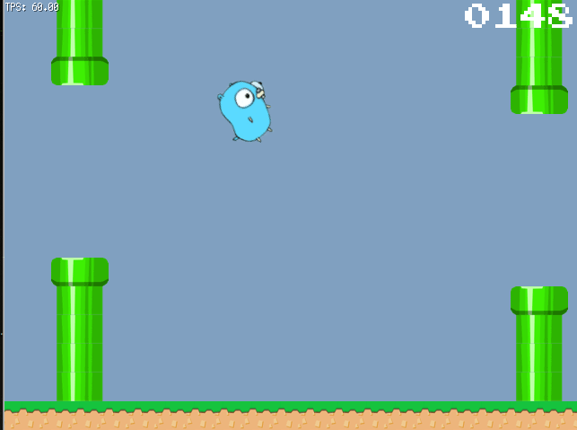

# flappy-nn

## Teaching a NEAT Neural Network to play [Flappy Gopher](https://github.com/hajimehoshi/ebiten/tree/master/examples/flappy)

If you want to play you first need to get [ebiten](https://github.com/hajimehoshi/ebiten) up and running on your system.

Then your should be able to run the [demo](./demo/) that I trained. This demo is playing with [winner-6.genome](./demo/winner-6.genome)

Then you can start to use the headless [emulator](./simulator.go) to make your own version using [goNeat](https://github.com/yaricom/goNEAT)

